# 🎬 Universal Media Ingestion Framework
*Think of it as a Smart Media Butler for Your Digital Library*

## 🌟 What Is This Project?

Imagine you have a massive digital library with movies, TV shows, books, music, podcasts, and more. Now imagine having a brilliant AI-powered butler who can:
- 🧠 **Understand** what each item is about
- 🔍 **Research** additional information from the internet
- 📝 **Enhance** each item with rich metadata
- 🎯 **Organize** everything intelligently
- 🚀 **Search** through it all at lightning speed

That's exactly what this Universal Media Ingestion Framework does! It's like having a team of specialized AI assistants working together to make your media collection incredibly smart and searchable.

## 🎭 The Restaurant Kitchen Allegory

Picture this framework as a **world-class restaurant kitchen** where your media items are the ingredients that get transformed into gourmet dishes:

```mermaid
graph TB
    subgraph "🍽️ Universal Media Restaurant"
        A[📦 Raw Media Items<br/>*Fresh Ingredients*] --> B[👨‍🍳 Head Chef<br/>*Ingestion Manager*]
        B --> C[📋 Recipe Book<br/>*YAML Configurations*]
        
        subgraph "🔥 Cooking Stations"
            D[🧠 AI Station<br/>*LLM Service*]
            E[🔍 Research Station<br/>*Web Search*] 
            F[📊 Analysis Station<br/>*NLP Services*]
            G[🏷️ Tagging Station<br/>*Keyword Extraction*]
        end
        
        C --> D
        C --> E
        C --> F
        C --> G
        
        D --> H[🎯 Quality Control<br/>*Result Merging*]
        E --> H
        F --> H
        G --> H
        
        H --> I[📚 Elegant Presentation<br/>*Enhanced Media*]
    end
```

## 🏗️ System Architecture: The Smart City Allegory

Think of our system as a **modern smart city** where different districts specialize in different tasks:

```mermaid
graph TB
    subgraph "🏙️ Universal Media City"
        subgraph "🏛️ City Hall District"
            API[🏛️ City Hall<br/>*Main API*]
            IM[👑 Mayor<br/>*Ingestion Manager*]
        end
        
        subgraph "🏭 Industrial District"
            WS[🏭 Processing Plant<br/>*Worker Service*]
            RM[⚡ Power Grid<br/>*Resource Manager*]
            QM[🚛 Logistics<br/>*Queue Manager*]
        end
        
        subgraph "🧠 AI Research District"
            LLM[🧠 Think Tank<br/>*LLM Service*]
            NLP[📊 Analytics Lab<br/>*NLP Services*]
            WEB[🔍 Investigation Bureau<br/>*Web Search*]
        end
        
        subgraph "📚 Knowledge District"
            MONGO[📚 Great Library<br/>*MongoDB*]
            REDIS[⚡ Message Center<br/>*Redis Cache*]
            FAISS[🔍 Search Index<br/>*Vector Database*]
        end
        
        API --> IM
        IM --> WS
        WS --> RM
        WS --> QM
        QM --> LLM
        QM --> NLP
        QM --> WEB
        LLM --> MONGO
        NLP --> MONGO
        WEB --> MONGO
        WS --> REDIS
        MONGO --> FAISS
    end
```

## 🎯 The Ingestion Process: From Raw to Refined

### 🌊 The Data Flow River

```mermaid
flowchart TD
    START[🎬 Raw Media Item] --> VALIDATE{📋 Valid Format?}
    VALIDATE -->|✅ Yes| ANALYZE[🔍 Analyze Fields]
    VALIDATE -->|❌ No| ERROR[❌ Reject Item]
    
    ANALYZE --> YAML[📖 Load YAML Recipe]
    YAML --> PLUGINS[🎭 Select Enhancement Plugins]
    
    subgraph "🎭 The Enhancement Theater"
        PLUGINS --> P1[🧠 LLM Keyword Plugin<br/>*The Wordsmith*]
        PLUGINS --> P2[🔍 Web Search Plugin<br/>*The Detective*]
        PLUGINS --> P3[📊 NLP Analysis Plugin<br/>*The Analyst*]
        PLUGINS --> P4[🏷️ Concept Expansion Plugin<br/>*The Librarian*]
        PLUGINS --> P5[⏰ Temporal Plugin<br/>*The Historian*]
        
        P1 --> MERGE[🎯 Merge Results<br/>*The Director*]
        P2 --> MERGE
        P3 --> MERGE
        P4 --> MERGE
        P5 --> MERGE
    end
    
    MERGE --> STORE[📚 Store in MongoDB]
    STORE --> INDEX[🔍 Update Search Index]
    INDEX --> DONE[✨ Enhanced Media Item]
```

## 🎭 Meet the Cast: Our AI Character System

### 🧠 The Plugins: Your Specialized AI Assistants

Think of plugins as **skilled artisans** in our media workshop:

#### 🎨 The Wordsmith (LLM Keyword Plugin)
```mermaid
graph LR
    A[📝 Raw Text] --> B[🧠 LLM Wordsmith]
    B --> C[💎 Refined Keywords]
    B --> D[🎯 Smart Summaries]
    B --> E[🏷️ Intelligent Tags]
```
*"I read your movie description and craft beautiful, meaningful keywords that capture its essence."*

#### 🔍 The Detective (Web Search Plugin)
```mermaid
graph LR
    A[🎬 Movie Title] --> B[🔍 Web Detective]
    B --> C[⭐ Reviews & Ratings]
    B --> D[🏆 Awards & Recognition]
    B --> E[📈 Box Office Data]
```
*"I investigate the internet to find the latest information about your media items."*

#### 📊 The Analyst (NLP Services)
```mermaid
graph LR
    A[📖 Text Content] --> B[📊 NLP Analyst]
    B --> C[😊 Sentiment Analysis]
    B --> D[👥 Named Entities]
    B --> E[⏰ Temporal Information]
```
*"I analyze the language to understand emotions, people, places, and time references."*

#### 🏷️ The Librarian (ConceptNet Plugin)
```mermaid
graph LR
    A[🎯 Keywords] --> B[🏷️ Concept Librarian]
    B --> C[🔗 Related Concepts]
    B --> D[📚 Knowledge Graph]
    B --> E[🎨 Semantic Expansion]
```
*"I connect your content to a vast web of human knowledge and understanding."*

### 🏢 The Services: Your Specialized Departments

Think of services as **expert departments** in our media corporation:

#### 🧠 The Think Tank (LLM Service)
*"We're the creative minds who understand language and generate insights."*

#### 🔍 The Research Department (Web Search Service)
*"We're the investigators who find the latest information from across the internet."*

#### 📊 The Analytics Division (NLP Services)
*"We're the scientists who analyze text and extract meaningful patterns."*

#### 🏷️ The Knowledge Management Team (ConceptNet Service)
*"We're the librarians who connect everything to human knowledge."*

### 🏭 The Providers: Your Skilled Craftspeople

Providers are like **master craftspeople** who actually do the detailed work:

```mermaid
graph TB
    subgraph "🏭 The Craftsmanship Workshop"
        A[🧠 LLM Provider<br/>*Master Linguist*] --> B[📝 Text Generation]
        A --> C[🎯 Keyword Extraction]
        A --> D[📋 Summarization]
        
        E[🔍 Web Provider<br/>*Master Researcher*] --> F[🌐 Search Execution]
        E --> G[📊 Data Collection]
        E --> H[🎯 Result Filtering]
        
        I[📊 NLP Provider<br/>*Master Analyst*] --> J[🏷️ Entity Recognition]
        I --> K[😊 Sentiment Analysis]
        I --> L[⏰ Temporal Extraction]
    end
```

## 📖 YAML: The Recipe Books

YAML configurations are like **detailed recipe books** that tell our AI chefs exactly how to prepare each type of media:

### 🎬 Movie Recipe Example
```yaml
# 🎬 Movie Enhancement Recipe
media_type: "movie"
description: "Recipe for making movies incredibly searchable and smart"

# 🥘 Ingredients (Fields to enhance)
fields:
  title:
    weight: 3.0        # 🔥 High importance
    plugins: ["llm_keyword", "web_search"]
  
  overview:
    weight: 2.5        # 🌟 Very important
    plugins: ["llm_keyword", "nlp_analysis", "concept_expansion"]
  
  genres:
    weight: 2.0        # 📊 Important
    plugins: ["concept_expansion"]

# 👨‍🍳 Cooking Instructions (Plugin configuration)
plugins:
  llm_keyword:
    temperature: 0.7   # 🎯 Creativity level
    max_keywords: 15   # 🏷️ Number of keywords
  
  web_search:
    max_results: 10    # 🔍 Research depth
    sources: ["imdb", "tmdb", "metacritic"]
```

### 🎵 Music Recipe Example
```yaml
# 🎵 Music Enhancement Recipe
media_type: "music"
description: "Recipe for making music collections sing with intelligence"

fields:
  artist:
    weight: 3.0
    plugins: ["web_search", "concept_expansion"]
  
  album:
    weight: 2.5
    plugins: ["llm_keyword", "web_search"]
  
  lyrics:
    weight: 2.0
    plugins: ["nlp_analysis", "sentiment_analysis"]
```

## 💻 System Requirements

### 🏷️ **TL;DR Quick Reference**

| **System Tier** | **CPU** | **RAM** | **Storage** | **Use Case** |
|------------------|---------|---------|-------------|--------------|
| **Minimum** | 4 cores | 8GB | 50GB SSD | Small collections, basic enrichment |
| **Recommended** | 8 cores | 16GB | 100GB SSD | Medium collections, full features |
| **High-Performance** | 16+ cores | 32GB+ | 200GB+ SSD | Large collections, maximum quality |

### 🎯 **Detailed Requirements by Deployment Tier**

#### 🥉 **Minimum Requirements** (Budget/Testing)
*"Getting your feet wet with a small media collection"*

| Component | Specification | Explanation |
|-----------|---------------|-------------|
| **CPU** | 4 cores, 8 threads | Core services need 2-4 threads each |
| **RAM** | 8GB total | Base services (2GB) + MongoDB (1GB) + models (3GB) + OS (2GB) |
| **Storage** | 50GB SSD | Docker images (10GB) + models (15GB) + data (25GB) |
| **GPU** | None required | CPU-only LLM models available |

**Model Optimizations for Minimum Systems:**
- Ollama: Use `llama3.2:1b` (1.3GB) instead of `llama3.2:3b` (2.0GB)
- SpaCy: Use `en_core_web_sm` (15MB) instead of `en_core_web_lg` (750MB)
- Disable GPU-intensive services in docker-compose

#### 🥈 **Recommended Requirements** (Balanced Performance)
*"Sweet spot for most users with medium collections"*

| Component | Specification | Explanation |
|-----------|---------------|-------------|
| **CPU** | 8 cores, 16 threads | Parallel processing of multiple media items |
| **RAM** | 16GB total | All services (8GB) + larger models (4GB) + caching (4GB) |
| **Storage** | 100GB SSD | Full model set (30GB) + growing media database (70GB) |
| **GPU** | 4GB VRAM (optional) | Accelerates LLM processing, 3-5x speed improvement |

**Optimal Model Configuration:**
- Ollama: `llama3.2:3b` for good quality/speed balance
- SpaCy: `en_core_web_md` (50MB) for good accuracy with word vectors
- All enrichment services enabled

#### 🥇 **High-Performance Requirements** (Maximum Quality)
*"Professional setups and large media libraries"*

| Component | Specification | Explanation |
|-----------|---------------|-------------|
| **CPU** | 16+ cores, 32+ threads | Concurrent processing of many items |
| **RAM** | 32GB+ total | Large models in memory + extensive caching |
| **Storage** | 200GB+ NVMe SSD | Full model collection + large database + logs |
| **GPU** | 8GB+ VRAM | Large LLM models, batch processing |

**Maximum Quality Configuration:**
- Ollama: `llama3.1:8b` or larger models for best quality
- SpaCy: `en_core_web_lg` (750MB) for maximum accuracy
- All services with increased resource limits

### 🔧 **Why Each Component Matters**

#### 🧠 **CPU Requirements Explained**
- **15 Microservices**: Each service needs 1-2 CPU threads minimum
- **AI Processing**: NLP analysis, keyword extraction, and text processing are CPU-intensive
- **Parallel Processing**: Multiple media items can be processed simultaneously
- **Background Tasks**: Queue management, health checks, and monitoring

#### 🐏 **Memory Requirements Breakdown**
```
Base Docker Services:          ~2GB
├── MongoDB + Redis:           ~1GB
├── Monitoring (Prometheus):   ~512MB
└── Base containers:           ~512MB

AI Models in Memory:           ~3-15GB
├── Ollama LLM:               ~1-8GB (model dependent)
├── SpaCy NLP:                ~15MB-750MB (model dependent)
├── Other AI models:          ~1-2GB
└── Model caching:            ~1-4GB

Application Runtime:           ~2-8GB
├── Service processes:        ~2GB
├── Request processing:       ~1-2GB
├── Result caching:          ~1-2GB
└── OS overhead:             ~2GB
```

#### 💾 **Storage Requirements Detail**
```
Docker Images:                 ~10GB
├── Base Python images:       ~3GB
├── Service images:           ~4GB
└── Infrastructure images:    ~3GB

AI Models:                     ~5-30GB
├── Ollama models:            ~1-20GB
├── SpaCy models:             ~15MB-750MB per language
├── NLTK data:                ~500MB
└── Gensim models:            ~1-5GB

Application Data:              ~Growing
├── MongoDB collections:      ~Varies by usage
├── Logs and metrics:         ~1-5GB
├── Cache storage:            ~2-10GB
└── Backup space:             ~20% of total
```

### ⚡ **Performance vs Resource Trade-offs**

#### 🎛️ **Model Size Impact on Performance**

| Model Choice | Size | Quality | Speed | Memory | Best For |
|--------------|------|---------|--------|---------|----------|
| `llama3.2:1b` | 1.3GB | Good | Fast | Low | Testing, small collections |
| `llama3.2:3b` | 2.0GB | Very Good | Medium | Medium | General use, balanced |
| `llama3.1:8b` | 4.7GB | Excellent | Slower | High | Large collections, quality-focused |

#### 🔄 **Service Scaling Options**

**Resource-Constrained Setup:**
```yaml
# Disable optional services
profiles: ["core"]  # Skip search, monitoring
deploy:
  resources:
    limits:
      memory: 512M    # Limit per service
      cpus: 0.5       # Limit CPU usage
```

**High-Performance Setup:**
```yaml
# Scale up resources
deploy:
  resources:
    limits:
      memory: 4G      # More memory per service
      cpus: 2.0       # More CPU allocation
    reservations:
      devices:
        - capabilities: ["gpu"]  # GPU acceleration
```

### 🏥 **Hardware Compatibility Notes**

#### 🖥️ **CPU Compatibility**
- **Minimum**: Intel Core i5 4th gen / AMD Ryzen 3000 series
- **Recommended**: Intel Core i7 8th gen / AMD Ryzen 5000 series
- **Architecture**: x86_64 required (ARM64 experimental)

#### 🎮 **GPU Support**
- **NVIDIA**: GTX 1060 6GB or newer (CUDA support)
- **AMD**: Limited support via ROCm (experimental)
- **Apple Silicon**: CPU-only mode (Metal acceleration coming)
- **Setup**: Requires NVIDIA Container Toolkit

#### 💿 **Storage Recommendations**
- **SSD Strongly Recommended**: 5-10x faster model loading
- **Network Storage**: Possible but may impact performance
- **Backup Strategy**: Regular MongoDB dumps recommended

### 🚀 **Getting Started with Your Hardware**

#### 📏 **Step 1: Assess Your System**
```bash
# Check your system specs
lscpu | grep -E "CPU|Thread|Core"
free -h
df -h
nvidia-smi  # If you have NVIDIA GPU
```

#### ⚙️ **Step 2: Choose Your Configuration**
- **8GB RAM or less**: Use minimum configuration
- **16GB RAM**: Standard recommended setup
- **32GB+ RAM**: High-performance configuration

#### 🎯 **Step 3: Optimize for Your Hardware**
- Edit `config/hardware/default.yaml` to match your specs
- Adjust `config/models/ollama_models.yaml` for model selection
- Modify docker-compose resource limits if needed

## 🚀 Getting Started: Your First Media Enhancement

### 1. 🏗️ Set Up Your Workshop
```bash
# Clone the magical workshop
git clone <repository-url>
cd universal-media-ingestion

# Set up your Python environment
./dev_setup.sh

# Activate your virtual environment
source .venv/bin/activate

# Start the AI services
docker-compose -f docker-compose.dev.yml up -d
```

### 2. 🎬 Enhance Your First Movie
```python
import requests

# 📝 Raw movie data
movie_data = {
    "title": "The Matrix",
    "year": 1999,
    "overview": "A computer hacker learns about the true nature of reality..."
}

# 🚀 Send to enhancement
response = requests.post(
    "http://localhost:8000/api/v1/ingestion/ingest",
    json={
        "media_type": "movie",
        "data": movie_data
    }
)

# ✨ Get enhanced result
enhanced_movie = response.json()
print(f"Enhanced with {len(enhanced_movie['keywords'])} keywords!")
```

### 3. 🔍 Search Your Enhanced Collection
```python
# 🎯 Search for action movies
search_response = requests.get(
    "http://localhost:8000/api/v1/search/query",
    params={
        "q": "cyberpunk action thriller",
        "media_type": "movie"
    }
)

results = search_response.json()
print(f"Found {len(results['items'])} matches!")
```

## 🔧 API Reference: Working Examples

### 📡 Main API Endpoints (Port 8000)

#### 🎬 **Ingest Media Items**
```bash
# Ingest a single movie with comprehensive spaCy analysis
curl -X POST "http://localhost:8000/api/v1/ingest/media" \
  -H "Content-Type: application/json" \
  -d '{
    "media_type": "movie",
    "media_items": [{
      "Name": "The Matrix",
      "Overview": "A computer hacker learns about the true nature of reality and joins a rebellion against the machines.",
      "Genres": ["Action", "Sci-Fi"],
      "ProductionYear": 1999
    }],
    "skip_enrichment": false,
    "batch_size": 1
  }'
```

#### 🔍 **Search Enhanced Media**
```bash
# Search for movies using AI-enhanced metadata
curl -X GET "http://localhost:8000/api/v1/search/movie" \
  -G \
  -d "query=cyberpunk dystopian reality" \
  -d "limit=10" \
  -d "include_metadata=true"
```

#### 📊 **Get Media Items**
```bash
# Retrieve all movies with enriched data
curl -X GET "http://localhost:8000/api/v1/media/movie" \
  -G \
  -d "limit=5" \
  -d "include_enriched=true"
```

#### ⚡ **Enrich Existing Media**
```bash
# Re-enrich a specific movie with updated plugins
curl -X POST "http://localhost:8000/api/v1/media/movie/enrich" \
  -H "Content-Type: application/json" \
  -d '{
    "item_filter": {"Name": "The Matrix"},
    "plugins": ["spacy_ner", "spacy_linguistic", "llm_keywords"],
    "force_refresh": true
  }'
```

#### 🔬 **Analyze Text Fields**
```bash
# Analyze a specific text field with spaCy
curl -X POST "http://localhost:8000/api/v1/media/analyze" \
  -H "Content-Type: application/json" \
  -d '{
    "text": "This critically acclaimed science fiction film explores themes of reality and consciousness.",
    "analysis_types": ["entities", "linguistic", "patterns"],
    "media_context": "movie"
  }'
```

### 🧠 SpaCy Service Endpoints (Port 8007)

#### 🏷️ **Named Entity Recognition**
```bash
# Extract people, organizations, locations, and more
curl -X POST "http://localhost:8007/providers/spacy/entities" \
  -H "Content-Type: application/json" \
  -d '{
    "text": "Directed by the Wachowskis and starring Keanu Reeves, The Matrix was filmed in Sydney, Australia and won four Academy Awards.",
    "field_name": "overview",
    "options": {
      "model": "en_core_web_md",
      "entity_types": ["PERSON", "ORG", "GPE", "WORK_OF_ART"],
      "confidence_threshold": 0.7,
      "group_by_type": true
    }
  }'
```

#### 📝 **Linguistic Analysis**
```bash
# Analyze sentence structure, POS tags, and readability
curl -X POST "http://localhost:8007/providers/spacy/linguistic" \
  -H "Content-Type: application/json" \
  -d '{
    "text": "In a dystopian future where humanity is unknowingly trapped inside a simulated reality, a computer programmer discovers the truth.",
    "field_name": "plot_analysis",
    "options": {
      "model": "en_core_web_md",
      "extract_pos": true,
      "extract_dependencies": true,
      "analyze_readability": true,
      "extract_adjectives": true
    }
  }'
```

#### 🔗 **Text Similarity**
```bash
# Compare similarity between two movie descriptions
curl -X POST "http://localhost:8007/providers/spacy/similarity" \
  -H "Content-Type: application/json" \
  -d '{
    "text1": "A computer hacker discovers the truth about reality.",
    "text2": "A programmer learns about the nature of the Matrix.",
    "options": {
      "model": "en_core_web_md"
    }
  }'
```

#### ⏰ **Temporal Analysis**
```bash
# Extract dates, times, and temporal concepts
curl -X POST "http://localhost:8007/providers/spacy_temporal/expand" \
  -H "Content-Type: application/json" \
  -d '{
    "concept": "Released in 1999, this groundbreaking film from the late 20th century",
    "media_context": "movie",
    "max_concepts": 10,
    "options": {
      "extract_dates": true,
      "normalize_dates": true
    }
  }'
```

### 🔧 Service Health & Management

#### 🏥 **Check Service Health**
```bash
# Main API health
curl -X GET "http://localhost:8000/health"

# SpaCy service health
curl -X GET "http://localhost:8007/health"

# Detailed provider health
curl -X POST "http://localhost:8007/providers/spacy_temporal/health"
```

#### 📦 **Model Management**
```bash
# Check model status
curl -X GET "http://localhost:8007/models/status"

# Download specific models
curl -X POST "http://localhost:8007/models/download" \
  -H "Content-Type: application/json" \
  -d '{
    "model_ids": ["english_model_md"],
    "force_download": false
  }'

# Check if models are ready
curl -X GET "http://localhost:8007/models/ready"
```

#### 📋 **Service Discovery**
```bash
# List available providers
curl -X GET "http://localhost:8007/providers"

# Get provider metadata
curl -X GET "http://localhost:8007/providers/spacy_temporal/metadata"
```

### 🎯 Advanced Workflow Examples

#### 🎬 **Complete Movie Analysis Pipeline**
```bash
# 1. Ingest with full enrichment
curl -X POST "http://localhost:8000/api/v1/ingest/media" \
  -H "Content-Type: application/json" \
  -d '{
    "media_type": "movie",
    "media_items": [{
      "Name": "Blade Runner 2049",
      "Overview": "A young blade runner discovers a secret that could plunge society into chaos and leads him on a quest to find Rick Deckard.",
      "Genres": ["Sci-Fi", "Thriller"],
      "ProductionYear": 2017,
      "Director": "Denis Villeneuve"
    }]
  }'

# 2. Search for similar content
curl -X GET "http://localhost:8000/api/v1/search/movie" \
  -G \
  -d "query=dystopian future androids" \
  -d "limit=5"

# 3. Get detailed enriched data
curl -X GET "http://localhost:8000/api/v1/media/movie" \
  -G \
  -d "filter_name=Blade Runner 2049" \
  -d "include_enriched=true"
```

#### 🔬 **Text Analysis Deep Dive**
```bash
# 1. Extract all entities
curl -X POST "http://localhost:8007/providers/spacy/entities" \
  -H "Content-Type: application/json" \
  -d '{
    "text": "Christopher Nolan'\''s Inception starring Leonardo DiCaprio explores the architecture of dreams.",
    "options": {"entity_types": "ALL", "confidence_threshold": 0.6}
  }'

# 2. Analyze linguistic complexity
curl -X POST "http://localhost:8007/providers/spacy/linguistic" \
  -H "Content-Type: application/json" \
  -d '{
    "text": "The film'\''s intricate narrative structure challenges conventional storytelling.",
    "options": {"analyze_readability": true, "extract_pos": true}
  }'

# 3. Find domain patterns
curl -X POST "http://localhost:8007/providers/spacy_temporal/expand" \
  -H "Content-Type: application/json" \
  -d '{
    "concept": "This critically acclaimed box office hit won the Academy Award for Best Picture.",
    "options": {"pattern_categories": ["awards", "critical_reception"]}
  }'
```

### 📊 Response Examples

#### 🏷️ **Entity Extraction Response**
```json
{
  "success": true,
  "provider_name": "spacy_ner",
  "execution_time_ms": 45.2,
  "result": {
    "structured_entities": {
      "people": [
        {"text": "Keanu Reeves", "confidence": 0.95, "label": "PERSON"},
        {"text": "Wachowskis", "confidence": 0.89, "label": "PERSON"}
      ],
      "organizations": [
        {"text": "Warner Bros", "confidence": 0.87, "label": "ORG"}
      ],
      "locations": [
        {"text": "Sydney", "confidence": 0.91, "label": "GPE"}
      ]
    },
    "total_entities": 4
  }
}
```

#### 📝 **Linguistic Analysis Response**
```json
{
  "success": true,
  "provider_name": "spacy_linguistic",
  "execution_time_ms": 67.8,
  "result": {
    "pos_analysis": {
      "complexity_indicators": {
        "noun_density": 25.5,
        "adjective_density": 12.3
      }
    },
    "sentence_analysis": {
      "avg_sentence_length": 18.5,
      "complexity_level": "medium"
    },
    "adjective_analysis": {
      "sentiment_indicators": {
        "positive_count": 3,
        "sentiment_score": 2
      }
    }
  }
}
```

## 🎯 Understanding the Two-Layer Architecture

### 🏗️ **API Layer vs Service Layer: When to Use Which**

Our system provides **two distinct interaction layers** designed for different use cases. Understanding when to use each is crucial for effective integration.

### 🎭 **High-Level API Layer** (`/api/v1/media/{media_type}/enrich`)
*The Orchestra Conductor*

This is the **user-facing, business logic layer** that orchestrates complete media enrichment workflows.

#### **What it does:**
- Orchestrates **multiple plugins** in sequence
- Applies **YAML configuration** rules automatically
- Manages **field mapping** and data transformation
- Handles **result merging** from multiple sources
- Stores results in **MongoDB** with full persistence
- Applies **confidence scoring** and **intelligent caching**

#### **Example: Complete Movie Enhancement**
```bash
# Enrich a complete movie with multiple AI services
curl -X POST "http://localhost:8000/api/v1/media/movie/enrich" \
  -H "Content-Type: application/json" \
  -d '{
    "item_filter": {"Name": "The Matrix"},
    "plugins": ["spacy_ner", "llm_keywords", "conceptnet_keywords"],
    "force_refresh": true
  }'
```

#### **What happens internally:**
1. 📖 Loads movie from MongoDB
2. ⚙️ Reads `movie.yaml` configuration
3. 🔄 Executes spaCy NER → LLM Keywords → ConceptNet in sequence
4. 🎯 Merges results using configured strategies
5. 💾 Stores enhanced data back to MongoDB
6. 📤 Returns complete enriched movie object

---

### 🔧 **Low-Level Service Layer** (`/providers/spacy/*`)
*The Individual Musicians*

This is the **raw NLP processing layer** that provides atomic, focused operations.

#### **What it does:**
- Performs **single, focused tasks**
- Processes **raw text** without business context
- Returns **structured NLP data** immediately
- No database interaction or persistence
- No configuration orchestration

#### **Example: Raw Text Analysis**
```bash
# Extract entities from any text
curl -X POST "http://localhost:8007/providers/spacy/entities" \
  -H "Content-Type: application/json" \
  -d '{
    "text": "Christopher Nolan directed Inception starring Leonardo DiCaprio",
    "options": {"entity_types": ["PERSON", "WORK_OF_ART"]}
  }'
```

#### **What happens internally:**
1. 🤖 Loads spaCy model
2. ⚡ Processes text with NER
3. 📊 Returns structured entity data
4. ✨ No storage, no orchestration - pure processing

---

## 🎪 **The Restaurant Analogy**

### 🍽️ **API Layer = Full Restaurant Experience**
- You order "the movie enhancement special"
- Kitchen coordinates multiple chefs (plugins)
- Follows the recipe book (YAML configuration)  
- Serves a complete, plated meal (enriched media object)
- Meal is recorded in your dining history (MongoDB)

### 👨‍🍳 **Service Layer = Individual Chef Stations**
- You go directly to the sushi chef (spaCy service)
- Request specific preparation (entity extraction)
- Get raw, unplated ingredients (structured NLP data)
- No coordination with other chefs
- No meal recording

---

## 🎯 **When to Use Each Layer**

### 🎬 **Use API Layer** (`/api/v1/media/...`) When:

✅ **Complete Media Processing**
```bash
# Process entire movies with full enrichment pipeline
curl -X POST "/api/v1/ingest/media" -d '{
  "media_type": "movie", 
  "media_items": [{"Name": "Blade Runner", "Overview": "..."}]
}'
```

✅ **Configuration-Driven Workflows**
- Want YAML rules applied automatically
- Need multiple plugins orchestrated together  
- Require result merging and confidence scoring

✅ **Production Media Management**
- Adding movies to your media library
- Re-enriching existing content
- Building media search indexes

✅ **Business Logic Operations**
- Database persistence required
- Complex field mapping needed
- Multi-step processing workflows

---

### 🧠 **Use Service Layer** (`/providers/spacy/...`) When:

✅ **Raw NLP Analysis**
```bash
# Analyze any text snippet
curl -X POST "/providers/spacy/entities" -d '{
  "text": "Any text you want analyzed"
}'
```

✅ **Building Custom Applications**
- Creating your own enrichment logic
- Bypassing the standard media workflow
- Experimenting with NLP capabilities

✅ **Research and Development**
- Testing spaCy model performance
- Comparing different analysis approaches
- Prototyping new features

✅ **Integration with External Systems**
- Your own database schema
- Custom data processing pipelines
- Real-time text analysis

---

## 🔄 **Real-World Usage Patterns**

### 📚 **Pattern 1: Complete Media Library Management**
```bash
# 1. Ingest movies with full enrichment (API Layer)
curl -X POST "/api/v1/ingest/media" \
  -d '{"media_type": "movie", "media_items": [...]}'

# 2. Search enhanced collection (API Layer)
curl -X GET "/api/v1/search/movie?query=cyberpunk"

# 3. Re-enrich with new plugins (API Layer)
curl -X POST "/api/v1/media/movie/enrich" \
  -d '{"plugins": ["spacy_linguistic"]}'
```

### 🔬 **Pattern 2: Custom Text Analysis Tool**
```bash
# 1. Extract entities (Service Layer)
curl -X POST "/providers/spacy/entities" \
  -d '{"text": "Custom text analysis"}'

# 2. Analyze linguistic features (Service Layer)
curl -X POST "/providers/spacy/linguistic" \
  -d '{"text": "Same text", "options": {"analyze_readability": true}}'

# 3. Process results in your application
# (Your custom logic here)
```

### 🎭 **Pattern 3: Hybrid Approach**
```bash
# 1. Use API for standard media (API Layer)
curl -X POST "/api/v1/ingest/media" -d '{...}'

# 2. Use services for custom fields (Service Layer)
curl -X POST "/providers/spacy/entities" \
  -d '{"text": "Custom metadata field"}'

# 3. Combine results in your application
```

---

## 📊 **Quick Decision Guide**

| **Need to...** | **Use This Layer** |
|----------------|-------------------|
| Manage movies/TV/books? | **API Layer** |
| Analyze any text? | **Service Layer** |
| Build a media app? | **API Layer** |
| Build an NLP tool? | **Service Layer** |
| Want YAML configuration? | **API Layer** |
| Want direct control? | **Service Layer** |
| Store in database? | **API Layer** |
| Process and discard? | **Service Layer** |

The API layer is your **media management system**, while the service layer is your **NLP toolkit**! 🎯

---

## 🏗️ Architecture Deep Dive

### 🎭 The Plugin System: A Theater Company

```mermaid
graph TB
    subgraph "🎭 The Enhancement Theater"
        DIRECTOR[🎬 Plugin Manager<br/>*The Director*]
        
        subgraph "🎨 Performance Stages"
            STAGE1[🧠 LLM Stage<br/>*Creative Writing*]
            STAGE2[🔍 Research Stage<br/>*Investigation*]
            STAGE3[📊 Analysis Stage<br/>*Data Science*]
            STAGE4[🏷️ Knowledge Stage<br/>*Connections*]
        end
        
        DIRECTOR --> STAGE1
        DIRECTOR --> STAGE2
        DIRECTOR --> STAGE3
        DIRECTOR --> STAGE4
        
        STAGE1 --> FINALE[🎯 Grand Finale<br/>*Result Merging*]
        STAGE2 --> FINALE
        STAGE3 --> FINALE
        STAGE4 --> FINALE
    end
```

### 🏭 The Service Ecosystem: An Industrial Symphony

```mermaid
graph TB
    subgraph "🏭 The Processing Symphony"
        CONDUCTOR[🎼 Service Orchestrator]
        
        subgraph "🎺 Brass Section - Core Services"
            API[🎺 API Service<br/>*The Announcer*]
            WORKER[🎺 Worker Service<br/>*The Performer*]
            MANAGER[🎺 Resource Manager<br/>*The Coordinator*]
        end
        
        subgraph "🎻 String Section - AI Services"
            LLM[🎻 LLM Service<br/>*The Virtuoso*]
            NLP[🎻 NLP Service<br/>*The Analyst*]
            SEARCH[🎻 Search Service<br/>*The Explorer*]
        end
        
        subgraph "🥁 Percussion Section - Data Services"
            MONGO[🥁 MongoDB<br/>*The Keeper*]
            REDIS[🥁 Redis<br/>*The Messenger*]
            FAISS[🥁 FAISS<br/>*The Finder*]
        end
        
        CONDUCTOR --> API
        CONDUCTOR --> WORKER
        CONDUCTOR --> MANAGER
        
        API --> LLM
        WORKER --> NLP
        WORKER --> SEARCH
        
        LLM --> MONGO
        NLP --> MONGO
        SEARCH --> MONGO
        
        WORKER --> REDIS
        MONGO --> FAISS
    end
```

## 🎯 Advanced Features

### 🔥 Queue Processing: The Smart Assembly Line

```mermaid
graph LR
    subgraph "🏭 Smart Assembly Line"
        INPUT[📦 Raw Media] --> QUEUE[📋 Task Queue]
        QUEUE --> CPU[💻 CPU Workers]
        QUEUE --> GPU[🎮 GPU Workers]
        
        CPU --> LIGHT[⚡ Light Tasks]
        GPU --> HEAVY[🔥 Heavy AI Tasks]
        
        LIGHT --> OUTPUT[✨ Enhanced Media]
        HEAVY --> OUTPUT
    end
```

### 🌐 Web Search Integration: The Information Highway

```mermaid
graph TB
    subgraph "🌐 Information Superhighway"
        QUERY[🔍 Search Query] --> SEARXNG[🚗 SearXNG Vehicle]
        SEARXNG --> SOURCES[🏪 Information Shops]
        
        subgraph "🏪 Knowledge Marketplace"
            IMDB[🎬 IMDb Store]
            WIKI[📚 Wikipedia Library]
            NEWS[📰 News Stand]
            SOCIAL[💬 Social Media Cafe]
        end
        
        SOURCES --> IMDB
        SOURCES --> WIKI
        SOURCES --> NEWS
        SOURCES --> SOCIAL
        
        IMDB --> RESULTS[🎯 Collected Information]
        WIKI --> RESULTS
        NEWS --> RESULTS
        SOCIAL --> RESULTS
        
        RESULTS --> LLM[🧠 AI Analysis]
        LLM --> ENHANCED[✨ Enhanced Knowledge]
    end
```

## 🏆 What Makes This Framework Special?

### 🌟 Universal Design
- 🎬 **Any Media Type**: Movies, music, books, podcasts, games, comics
- 🔌 **Any Data Source**: Jellyfin, Plex, JSON files, APIs
- 🧠 **Any AI Provider**: OpenAI, Anthropic, local models

### 🚀 Performance & Scalability
- ⚡ **Parallel Processing**: Multiple AI workers running simultaneously
- 🎯 **Smart Resource Management**: CPU and GPU tasks scheduled optimally
- 📊 **Comprehensive Monitoring**: Real-time metrics and health checks

### 🎨 Developer-Friendly
- 🧩 **Plugin Architecture**: Easy to extend with new capabilities
- 📖 **Configuration-Driven**: No code changes needed for new media types
- 🔧 **Rich APIs**: Full REST API for all operations

## 🎓 Learning Resources

### 📚 For Beginners
1. **Start Here**: Run the setup script and enhance your first movie
2. **Explore**: Look at the YAML configurations in `config/media_types/`
3. **Experiment**: Try different plugins and see how they change results

### 🔬 For Advanced Users
1. **Custom Plugins**: Create your own enhancement plugins
2. **New Services**: Add new AI services to the ecosystem
3. **Performance Tuning**: Optimize for your specific use case

### 🏗️ For Developers
1. **Architecture**: Study the service and plugin patterns
2. **Testing**: Run the comprehensive test suite
3. **Contributing**: Add new features following the established patterns

## 🎉 Success Stories

*"I pointed this at my 10,000 movie collection and it found connections I never knew existed!"* - Happy User

*"The web search integration keeps my metadata fresh and current automatically."* - Media Enthusiast

*"Building custom plugins was surprisingly straightforward with the HTTP-only architecture."* - Developer

---

## 🤝 Contributing

This framework thrives on community contributions! Whether you're:
- 🎨 Adding new enhancement plugins
- 🔧 Improving existing services
- 📖 Enhancing documentation
- 🐛 Fixing bugs

Your contributions make this universal media framework even more powerful!

---

**🎬 Ready to transform your media collection into an intelligent, searchable, AI-enhanced library? Let's get started!**