# Architecture Diagrams

## 1. Current System Overview (Simple)

```mermaid
graph TD
    User[👤 User] --> API[📡 FastAPI]
    API --> Redis[📮 Redis Queue]  
    Redis --> Worker[⚙️ Worker<br/>2GB+ RAM<br/>ALL NLP deps]
    Worker --> Plugins[🔌 Plugins]
    Plugins --> Providers[🧩 Providers<br/>ConceptNet/LLM/Gensim]
    Providers --> MongoDB[(🗄️ MongoDB<br/>Cache)]
```

## 2. Target Architecture (Stage 4.3)

```mermaid
graph TD
    User[👤 User] --> API[📡 FastAPI]
    API --> Redis[📮 Redis Queue]
    
    Redis --> W1[⚙️ Worker 1<br/>500MB<br/>Plugin Router]
    Redis --> W2[⚙️ Worker 2<br/>500MB<br/>Plugin Router] 
    Redis --> W3[⚙️ Worker 3<br/>500MB<br/>Plugin Router]
    
    W1 --> Router[🌐 PluginRouter<br/>Service Discovery]
    W2 --> Router
    W3 --> Router
    
    Router --> NLP[🧠 NLPService<br/>2GB RAM<br/>SpaCy+HeidelTime]
    Router --> LLM[🤖 LLMService<br/>1GB RAM<br/>Ollama Client]
    
    NLP --> MongoDB[(🗄️ MongoDB)]
    LLM --> MongoDB
```

## 3. Plugin Architecture Detail

```mermaid
graph TD
    subgraph "Current Plugins"
        BasePlugin[BasePlugin<br/>Resource mgmt]
        ConceptPlugin[ConceptExpansionPlugin<br/>Direct provider calls]
        TemporalPlugin[TemporalAnalysisPlugin<br/>Direct provider calls]
    end
    
    subgraph "New Service Plugins"
        HTTPPlugin[HTTPProviderPlugin<br/>HTTP client base]
        RemotePlugin[RemoteConceptPlugin<br/>HTTP → NLPService]
        HealthPlugin[ServiceHealthPlugin<br/>Circuit breaker]
    end
    
    ConceptPlugin -.->|Transform| RemotePlugin
    BasePlugin --> HTTPPlugin
```

## 4. Worker Task Processing (THE TODO!)

```mermaid
graph TD
    Queue["📮 Redis Queue<br/>task_type: concept_expansion"] 
    Queue --> Worker["⚙️ Worker Process"]
    
    Worker --> Current["❌ Current TODO<br/>Simulate processing<br/>await asyncio.sleep"]
    
    Worker --> Target["✅ Target Implementation<br/>Plugin Task Dispatcher"]
    
    Target --> Load["Load plugin by name"]
    Load --> Route{"Route by task_type"}
    
    Route -->|concept_expansion| ConceptPlugin["ConceptExpansionPlugin"]
    Route -->|temporal_analysis| TemporalPlugin["TemporalAnalysisPlugin"] 
    Route -->|question_expansion| QuestionPlugin["QuestionExpansionPlugin"]
    Route -->|plugin_execution| DynamicLoad["Dynamic Plugin Load"]
```

## 5. Service Communication Flow

## 6. Implementation Phases

